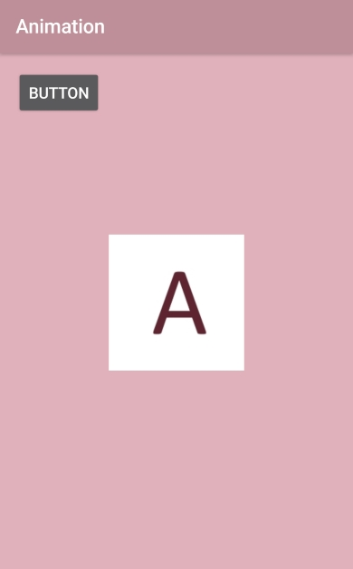
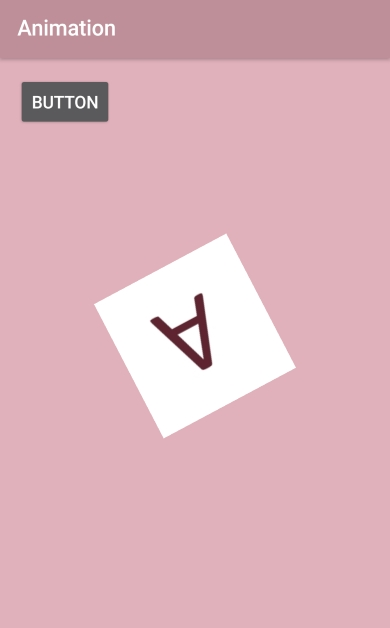
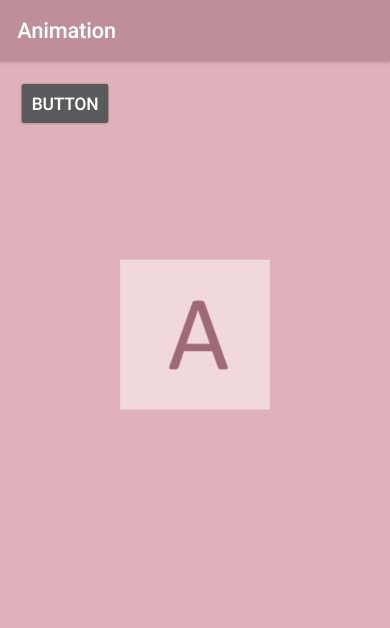

# Animation
Android Animation (改自Android群英傳)

實現了幾個簡單的動畫效果，
每按一次button就會輪流對圖片執行一次不同的動畫效果，
總共有：
透明度動畫、旋轉動畫(分為旋轉起始角度和旋轉中心點兩種)、位移動畫、縮放動畫(可以選擇縮放圖片的任一處作為縮放中心)

↓ 執行畫面(原圖) 

 
↓ 執行畫面(旋轉中心點動畫) 

 
↓ 執行畫面(透明度動畫) 

 
App download ↓
https://drive.google.com/open?id=0B0csiWXavBDHNEt1VnNvay1BNjQ
